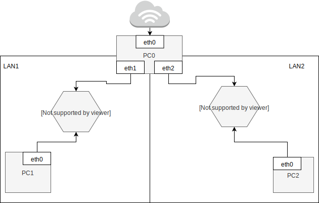
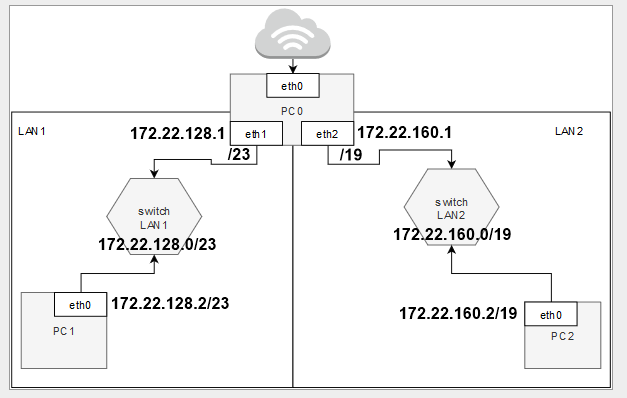

Zadanie 1
---------



1. Zaprojektuj oraz przygotuj prototyp rozwiązania z wykorzystaniem oprogramowania ``VirtualBox`` lub podobnego. 
Zaproponuj rozwiązanie spełniające poniższe wymagania:
   * Usługodawca zapewnia domunikację z siecią internet poprzez interfejs ``eth0`` ``PC0``
   * Zapewnij komunikację z siecią internet na poziomie ``LAN1`` oraz ``LAN2``
   * Dokonaj takiego podziału sieci o adresie ``172.22.128.0/17`` aby w ``LAN1`` można było zaadresować ``500`` adresów natomiast w LAN2 ``5000`` adresów    
   * Przygotuj dokumentację powyższej architektury w formie graficznej w programie ``DIA``
   
   
2.Rozwiązanie zadania
---------------------
2.1
---
1. Dane jest, że komunikację z siecią internet zapewnia usługodawca (dla ``eth0`` i ``PC0``).
2. Należy dokonać podziału sieci o adresie ``172.22.128.0/17``
  * 500 adresów w ``LAN1``
  * 5000 adresów w ``LAN2``.
  
2.2
---
1. Podział sieci.

| ilość | netmaska | adres | komentarz |
|-------|----------|-------|-----------|
| 500 urządzeń  | /23 | 255.255.254.0 | zmieści się 510 adresów |
| 5000 urządzeń | /19 | 255.255.224.0 | zmieści się 8190  adresów |

| 1 | 2 | 3 |
|---|---|---|
| IP startowy | 172.22.128.0    | podany adres |                                                                      
|   ``LAN1``  | 172.22.128.0/23 | korzystając z obliczeń w kalkulatorze - kolejne adresy w /23 zaczynają się od 128 |
|   ``LAN2``  | 172.22.160.0/19 | Korzystając z obliczeń w kalkulatorze - kolejne adresy w /19 zaczynają się od 160 (128 zajęty)

2. Dodawanie adresów IP.
  * używamy polecenia ``ip addr add + 'ip' + dev + 'interfejs'``
  * oraz polecenia ``ip link set + interfejs + down/up``
  
  * PC0:
    - ip addr add ``172.22.128.1/23`` dev ``enp0s8``
    - ip link set ``enp0s8`` down
    - ip link set ``enp0s8`` up

    - ip addr add ``172.22.160.1/19`` dev ``enp0s9``
    - ip link set ``enp0s9`` down
    - ip link set ``enp0s9`` up

   * PC1:
    - ip addr add ``172.22.128.2/23`` dev ``enp0s3``
    - ip link set ``enp0s3`` down
    - ip link set ``enp0s3`` up

   * PC2:
    - ip addr add ``172.22.160.2/19`` dev ``enp0s3``
    - ip link set ``enp0s3`` down
    - ip link set ``enp0s3`` up

3. Ustawianie routingu.
  * używamy polecenia ``ip route add default via + adres``
  
  * PC1:
    - ip route add default via 172.22.128.1
  * PC2:
    - ip route add default via 172.22.160.1
  
4. IP Forwarding PC0.
  * używamy polecenia ``echo 1 > /proc/sys/net/ipv4/ip_forward``
  * ustawiamy tak, aby ``net.ipv4.ip_forward=1`` było aktywne (plik ``/etc/sysctl.d/99-sysctl.conf``)
  
  
5. Masquerade PC0.
  * używamy polecenia ``iptables -t nat -A POSTROUTING -s + adres + -o + interfejs + -j MASQUERADE`` 
  * PC0:
    - iptables -t nat -A POSTROUTING -s ``172.22.128.0/23`` -o ``enp0s3`` -j MASQUERADE
    - iptables -t nat -A POSTROUTING -s ``172.22.160.0/19`` -o ``enp0s3`` -j MASQUERADE
    
6. Ustawianie DNS w PC1 i PC2:
  * zmiana w ``/etc/resolv.conf``
    na ``nameserver 1.1.1.1``
    
    
3.KONIEC
--------
 

```
